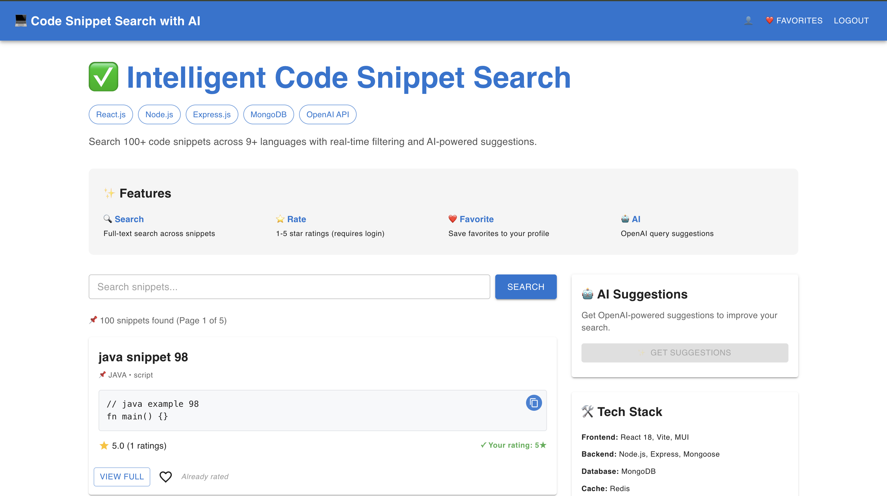
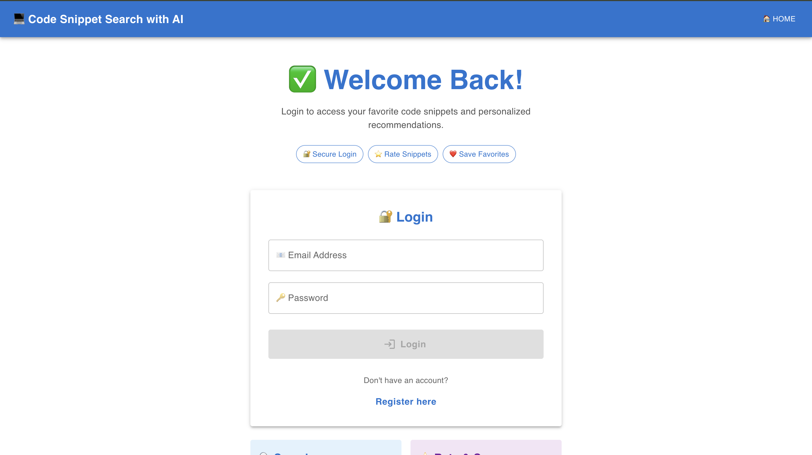
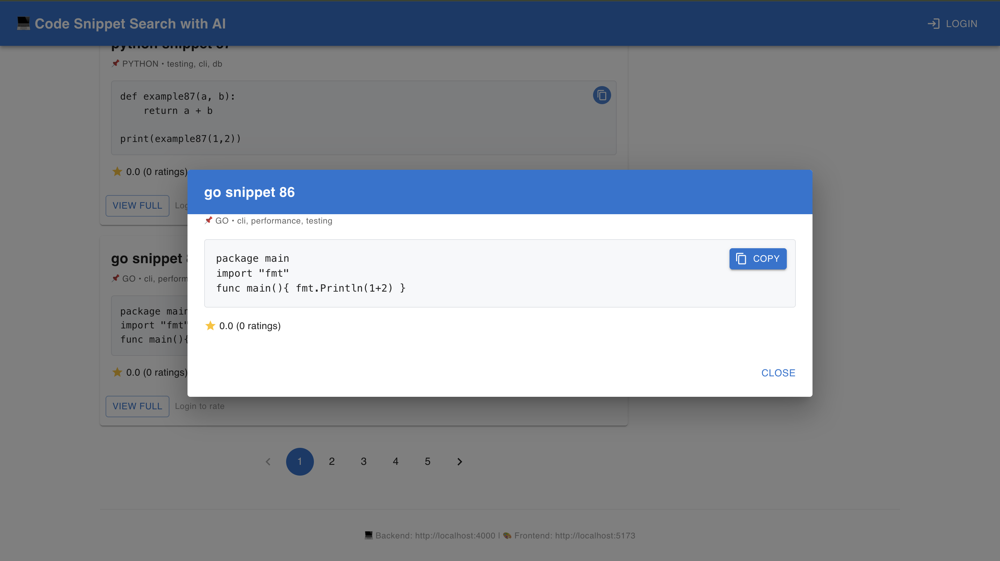

# 🔍 Intelligent Code Snippet Search with AI

A full-stack MVP application that intelligently searches code snippets across multiple programming languages with AI-powered suggestions powered by OpenAI.

**Stack:** React 18 + Vite + Material-UI | Node.js + Express | MongoDB | Redis | OpenAI API

---

## 📸 Screenshots

### Home Page - Search Interface


### Login Page - User Authentication


### Snippet Details - Code Preview & Interactions


---

## ✨ Features

### 🔎 Search & Discovery
- **Real-time search** across 100+ code snippets
- **Multi-language support** - JavaScript, Python, Java, C++, Go, Rust, TypeScript, PHP, C#
- **Redis caching** for lightning-fast search results
- **Text indexing** with MongoDB for accurate matches

### ⭐ User Interactions
- **Rate snippets** with a 1-5 star system
- **Favorite snippets** to build a personal collection
- **Favorites page** to view all saved snippets

### 🤖 AI-Powered Features
- **Smart AI suggestions** powered by OpenAI
- Context-aware recommendations based on search queries

### 👤 User Management
- **Secure authentication** with JWT + bcrypt
- **User accounts** with persistent favorites and ratings
- **Session management** with localStorage persistence

---

## 🏗️ Project Structure

```
CODE_SNIPPET_PROJECT/
├── frontend/                          # React + Vite frontend
│   ├── src/
│   │   ├── pages/
│   │   │   ├── SearchPage.jsx         # Main search interface (home)
│   │   │   ├── LoginPage.jsx          # Authentication
│   │   │   ├── FavoritesPage.jsx      # User's saved snippets
│   │   │   ├── DemoPage.jsx           # Demo with mock data
│   │   │   └── TestPage.jsx
│   │   ├── state/
│   │   │   └── auth.jsx               # Auth context provider
│   │   ├── utils/
│   │   │   ├── axiosLogger.js
│   │   │   └── logger.js
│   │   └── main.jsx
│   ├── package.json
│   ├── vite.config.js
│   └── index.html
│
├── backend/                            # Node.js + Express backend
│   ├── src/
│   │   ├── index.js                   # Express server entry
│   │   ├── middleware/
│   │   │   ├── auth.js                # JWT verification
│   │   │   ├── error.js               # Error handling
│   │   │   └── logger.js              # Request logging
│   │   ├── models/
│   │   │   ├── User.js                # User schema
│   │   │   ├── Snippet.js             # Code snippet schema (with text index)
│   │   │   ├── Rating.js              # Rating schema
│   │   │   └── Favorite.js            # Favorite schema
│   │   ├── routes/
│   │   │   ├── auth.js                # Register/login endpoints
│   │   │   ├── snippets.js            # Search, details, rate, favorite
│   │   │   ├── ai.js                  # AI suggestions endpoint
│   │   │   └── me.js                  # User favorites endpoint
│   │   ├── lib/
│   │   │   └── redisClient.js         # Redis connection
│   │   └── utils/
│   │       └── validateObjectId.js
│   ├── scripts/
│   │   ├── seedSnippets.js            # Seed 100 code snippets
│   │   └── createIndexes.js           # Create MongoDB indexes
│   ├── tests/
│   │   ├── auth.test.js               # Auth endpoint tests
│   │   └── snippets.test.js           # Snippet endpoint tests
│   ├── package.json
│   └── .env.example
│
├── public/                            # Images and static assets
├── README.md                          # This file
├── QUICK_START.md                     # Quick setup guide
└── PROJECT_STATUS.md                  # Detailed project status
```

---

## 🚀 Quick Start

### Prerequisites
- **Node.js** 18+ 
- **MongoDB** (local or cloud)
- **Redis** (local or cloud)
- **OpenAI API Key** (for AI features)

### Installation & Setup

**1. Clone and Install Dependencies**

```bash
# Backend
cd backend
npm install

# Frontend
cd frontend
npm install
```

**2. Start Database Services (macOS with Homebrew)**

```bash
# Install if needed
brew install mongodb-community@6.0 redis

# Start services
brew services start mongodb-community@6.0
brew services start redis
```

> For other OS or cloud databases, adjust the connection strings in `.env`

**3. Configure Environment Variables**

Backend (`backend/.env`):
```env
# Server
NODE_ENV=development
PORT=4000

# Database
MONGO_URI=mongodb://localhost:27017/code_snippets
REDIS_URL=redis://localhost:6379

# Authentication
JWT_SECRET=your_secure_jwt_secret_here

# AI Features
OPENAI_API_KEY=your_openai_api_key_here
```

Frontend (`frontend/.env.local`):
```env
VITE_API_URL=http://localhost:4000
```

**4. Seed Database (Optional but Recommended)**

```bash
cd backend
npm run seed
```

This creates 100 code snippets across 9 programming languages.

**5. Start Development Servers**

```bash
# Terminal 1: Backend
cd backend
npm run dev
# Backend running at http://localhost:4000

# Terminal 2: Frontend
cd frontend
npm run dev
# Frontend running at http://localhost:5173
```

---

## 📚 API Endpoints

### Authentication
- `POST /api/auth/register` - Create new account
- `POST /api/auth/login` - User login
- `POST /api/auth/logout` - User logout

### Snippets
- `GET /api/snippets/search?q=keyword` - Search snippets
- `GET /api/snippets/:id` - Get snippet details
- `POST /api/snippets/:id/rate` - Rate a snippet
- `POST /api/snippets/:id/favorite` - Add to favorites
- `DELETE /api/snippets/:id/favorite` - Remove from favorites

### User
- `GET /api/me/favorites` - Get user's favorite snippets
- `GET /api/me` - Get user profile

### AI
- `POST /api/ai/suggest` - Get AI-powered suggestions

---

## 🧪 Testing

```bash
cd backend
npm test
```

Runs Jest tests for authentication and snippet endpoints.

---

## 🛠️ Tech Stack

### Frontend
- **React 18** - UI library
- **Vite 5** - Build tool & dev server
- **Material-UI 5** - Component library
- **React Router DOM 6** - Client-side routing
- **Axios** - HTTP client

### Backend
- **Node.js** - JavaScript runtime
- **Express 4** - Web framework
- **MongoDB** with Mongoose - Database
- **Redis** with ioredis - Caching
- **JWT + bcrypt** - Authentication & security
- **OpenAI API** - AI suggestions
- **Jest** - Testing framework

---

## 📊 Data Models

### User
```javascript
{
  _id: ObjectId,
  username: String (unique),
  email: String (unique),
  password: String (hashed),
  createdAt: Date
}
```

### Snippet
```javascript
{
  _id: ObjectId,
  title: String,
  description: String,
  code: String,
  language: String,
  tags: [String],
  averageRating: Number,
  createdAt: Date
}
```

### Rating
```javascript
{
  _id: ObjectId,
  userId: ObjectId (ref: User),
  snippetId: ObjectId (ref: Snippet),
  rating: Number (1-5),
  createdAt: Date
}
```

### Favorite
```javascript
{
  _id: ObjectId,
  userId: ObjectId (ref: User),
  snippetId: ObjectId (ref: Snippet),
  createdAt: Date
}
```

---

## 📝 Environment Files

### backend/.env.example
```env
NODE_ENV=development
PORT=4000
MONGO_URI=mongodb://localhost:27017/code_snippets
REDIS_URL=redis://localhost:6379
JWT_SECRET=your_jwt_secret
OPENAI_API_KEY=your_openai_key
```

### frontend/.env.example
```env
VITE_API_URL=http://localhost:4000
```

---

## 🔒 Security Features

- ✅ **JWT Authentication** - Secure token-based auth
- ✅ **Password Hashing** - bcrypt with salt rounds
- ✅ **CORS Protection** - Configured for frontend origin
- ✅ **Rate Limiting** - Express rate limiter on auth endpoints
- ✅ **Helmet** - HTTP security headers
- ✅ **Environment Variables** - Sensitive data protected

---

## 📖 Documentation

- [QUICK_START.md](QUICK_START.md) - 5-minute setup guide
- [PROJECT_STATUS.md](PROJECT_STATUS.md) - Detailed project status & features

---

## 🎯 Future Enhancements

- [ ] Advanced filtering (by language, difficulty, tags)
- [ ] Code syntax highlighting
- [ ] Snippet comments & discussions
- [ ] User profiles & contributions
- [ ] Mobile app
- [ ] Deployment guides (Heroku, Vercel, AWS)

---

## 📄 License

This project is open source and available under the MIT License.

---

## 👨‍💻 Development

**Available Scripts:**

Backend:
```bash
npm run dev       # Start dev server with nodemon
npm run start     # Start production server
npm run seed      # Seed database with snippets
npm test          # Run test suite
```

Frontend:
```bash
npm run dev       # Start Vite dev server
npm run build     # Build for production
npm run preview   # Preview production build
```

---

**Happy Coding! 🚀**

API Overview
- `GET /api/snippets?q=&language=&tag=&page=&limit=` - public search, cached in Redis for anonymous
- `GET /api/snippets/:id` - snippet details (cached)
- `POST /api/snippets/:id/rate` - protected, body { value }
- `POST /api/snippets/:id/favorite` - protected
- `DELETE /api/snippets/:id/favorite` - protected
- `GET /api/me/favorites` - protected
- `POST /api/ai/suggest` - body { query, topSnippetIds }

Testing
- Backend tests use Jest + Supertest:
```bash
cd backend
npm install
npm test
```

Notes & tradeoffs
- Ratings stored in separate `Rating` collection to allow efficient per-user unique votes and aggregation.
- Search uses Mongo text index; Redis caches search results for anonymous users only.
- AI endpoint uses OpenAI; prompt and payloads are truncated to avoid huge inputs.
